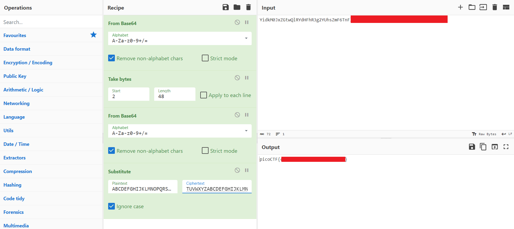

# interencdec (50 points)
for solving this problem, you need to use base64 decode 2 times and then use ceasar cipher to get the flag. you can use [CyberChef](https://gchq.github.io/CyberChef/) to do so.
**note**: just convert the alphabet in the ceacar cipher, symbols doesn't need to change.

