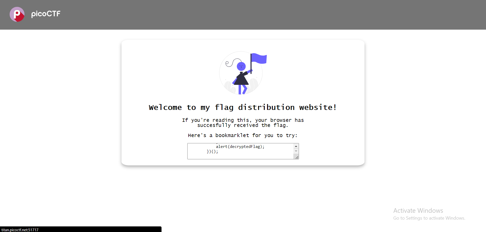
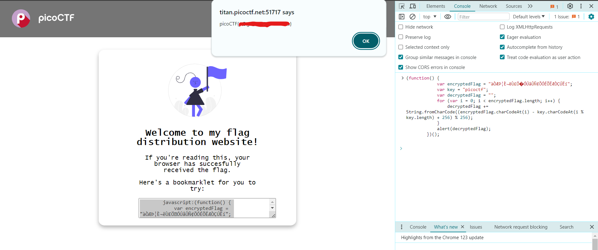

# Bookmarklet (50 points)

when you open the url for this question, this page shows up

for you to answer that question, just copy the code that shown to you and remove the `javascript:` from start of the code.

after that, open **DevTools** By pressing `F12` and paste the code on the console and and execute it. the flag shown as the alert

