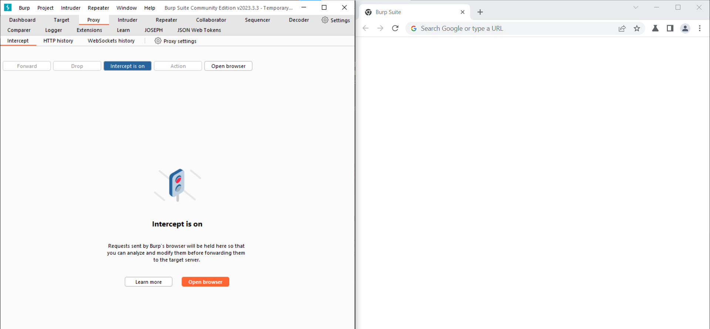
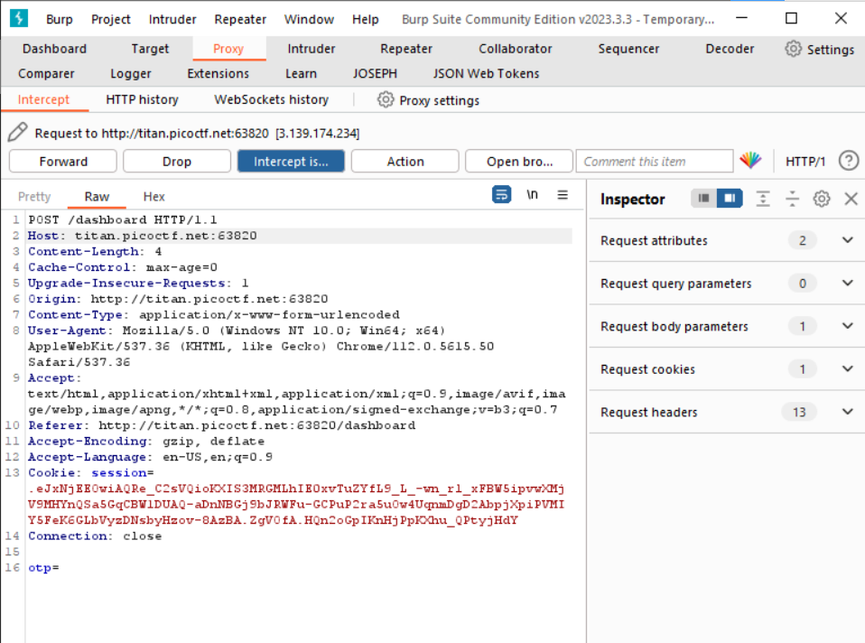
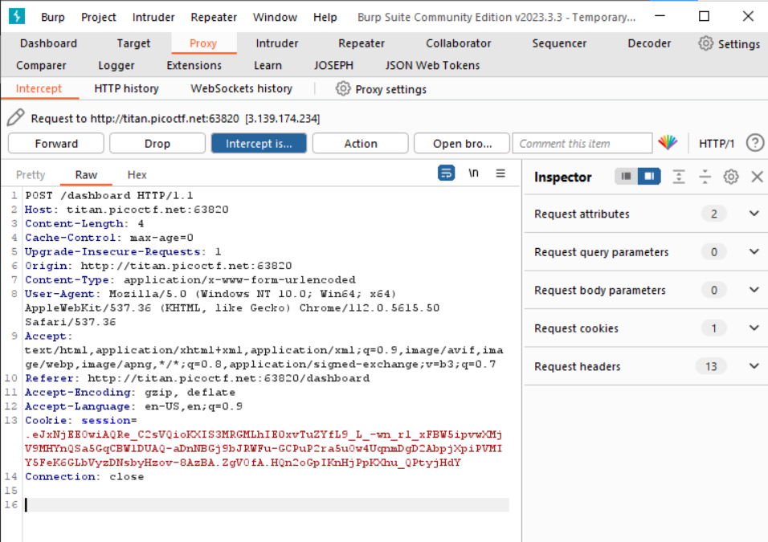

# IntroToBurp (100 points)

for solving this question, you first need to install [burp](https://portswigger.net/burp/communitydownload). after this, go to the *proxy* tab  and turn on the `intercept` and than click on the `open browser`.

from now, you can see all off http request that come at burp browser.

in browser, go to the site and register. after this page, you redirect to the page that want you to submit an OTP code, turn on the `intercept` and press the submit button and the go to the burp proxy.

delete the body of the request and than forward it. 

if you done this correctly, you should see the flag in the browser.