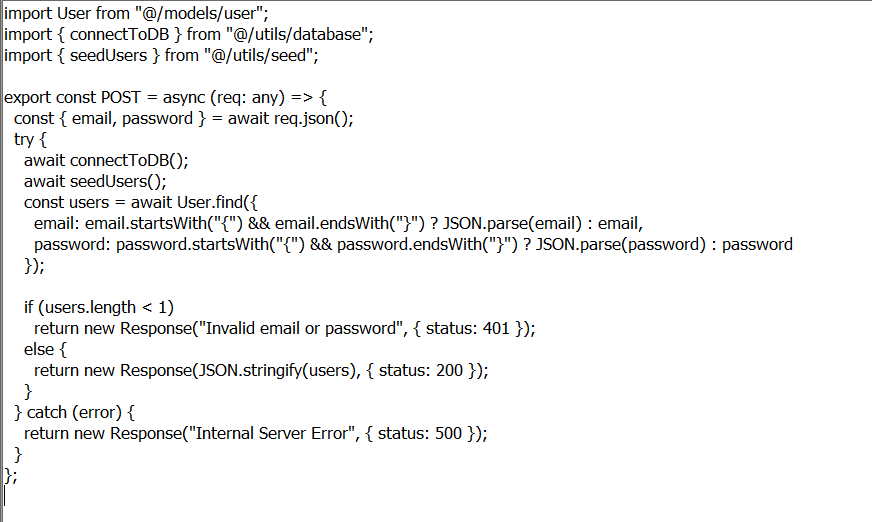
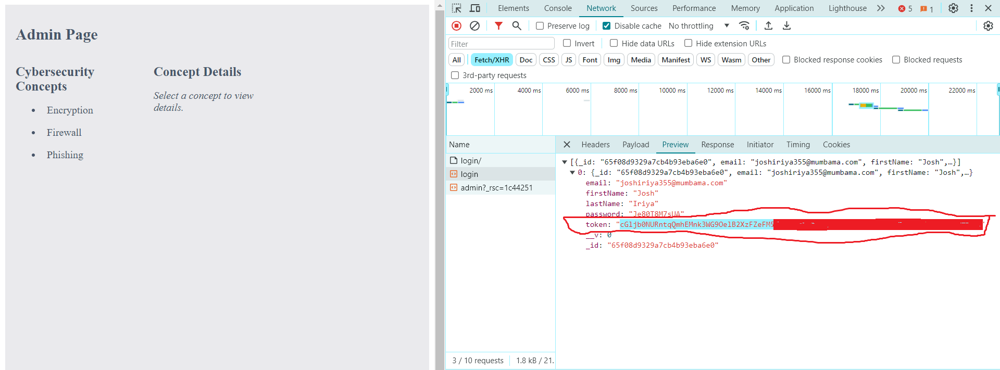

# No Sql Injection (200 points)

for this problem, you should look at the code and see what it do.

as you can see; for the login code if the input is json, the code first parse it and then send it to database. we can use this to craft a payload that always be true and hence, we can logged in without knowing the usename or password

for more information about nosql attack. see [this article](https://portswigger.net/web-security/nosql-injection)

for this example, we use `{"$ne": ""}` input for username.

if you look at the response of the *login* api call. you should see that you logged in successfully and the response has suspicious value for field `token` that encoded with base64. if you decode it, you should see the flag.

