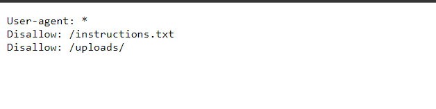
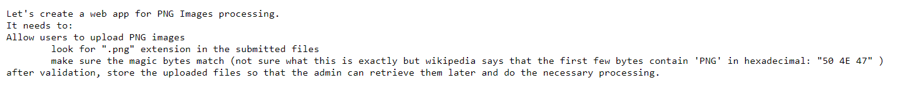
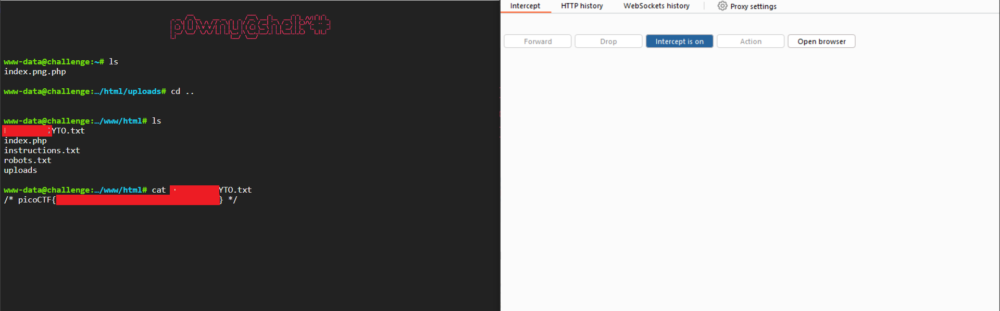

# Trickster (300 points)

for solving this, first we check what is the programming language is use. what is the web server and what is the routes.

for checking programming and web server, you can use [wappalyzer](https://www.wappalyzer.com/) extention. if you don't want to use this. just add `index.php` to url and see that the homepage is still there. for web server, check the not found error.

for finding directorys, check the `robots.txt` file, the content of the files should be like this

with this file, we find out that we have `instructions.txt` file and `uploads` directory.

after this, we check the contents of `instructions.txt` file.

for more information about magic number, check out this [page](https://gist.github.com/leommoore/f9e57ba2aa4bf197ebc5)

we want to upload a php file and execute it. by how bypass this checks? 

for the filename postfix, we name our php file `index.png.php`. for the magic number check, we begin the content of the file with hex codes `50 4e 47` or `PNG` characters. in windows, you can use the shortcode to write hex directly. just hold `Alt` and type the decimal code of the character you want to type. for more information, check out this [article](https://www.freecodecamp.org/news/alt-codes-special-characters-keyboard-symbols-windows-list/).

after typing the magic number, you must append the php code. for this question i use the php shell in [here](https://github.com/flozz/p0wny-shell).

after uploading this file. you can now visit the `[YOUR_DOMAIN]/uploads/index.png.php` and now you have terminal access.

**important note**: if you get the error of **is Not valid json** in the terminal, you can run burp and in the response, remove the redunant content and than forward it.

