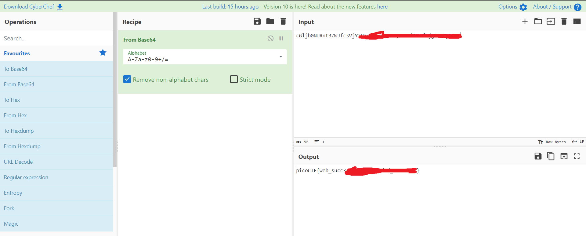

# WebDecode (50 points)

for solving this, you need to explore the website. and also see the **source file** for finding the flag.

to view the source of the page, right click on the page and select `view source` option.

this site contains 3 pages. in the **about** page. we see something suspicious in the source.

copy this code and decode it using a base64 decoder. i recommend [CyberChef](https://gchq.github.io/CyberChef/) to do so.

if you don't know what encrypting algorithm used for this, in cyber chef,  you can use `magic` instead of `From Base64` .

and here is the flag.